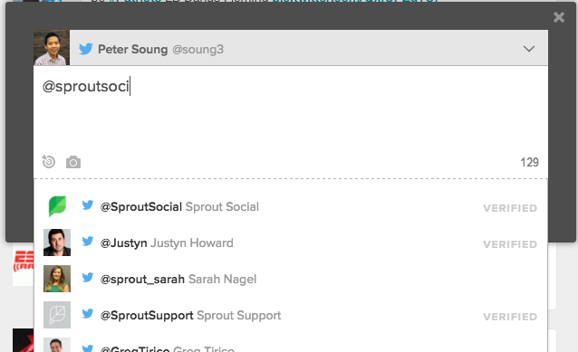

# Twitter Autocomplete mentions

### Prerequisites

Assuming that:

1. npm is installed
2. The server-side API is running at <http://localhost:3001>

Run the following commands:

```
npm install
npm start
```

This should automatically open a browser window serving the files. If not, navigate to <http://localhost:9000>

### UI/UX

I tried to model the look of the page after the screenshot included in the spec:



For UX, I tried to follow how twitter's UI behaves, such as the character countdown for tweets, which turns red as you meet or exceed the 140 character maximum.

I also added a few keyboard shortcuts for selected mention suggestions:

* **Tab/Enter** - Select the currently focused mention, or the first one in the list
* **Up/Down Arrows** - Navigate through the list of suggested mentions

### Implementation Notes

#### contentEditable `div` vs `<textarea>`
One of the first major things I needed to decide in building this was how to structure the box in which the actual tweet was being typed. I was conflicted between using a `<textarea>` element or a `<div>` with `contentEditable="true"`. In researching this, it was interesting to note that Facebook had the same issues in the years before React was open-sourced ([here's a talk discussing this from last year's React Conf](https://www.youtube.com/watch?v=feUYwoLhE_4)). Given the complexities introduced by a `<div>` for such a small app, I chose to take the `<textarea>` for a solution that worked well for the small features I needed to provided for this challenge. For scalability, a better long-term choice would be the `div` route (or better yet, FB's open-sourced [solution](https://facebook.github.io/draft-js/)).

#### Edge cases and Things to improve

* If the last word is a mention and you want to get rid of the space inserted after a mention, the suggestions will pop up again, which are probably not be the user's intentions.
* The app currently assumes that the word to suggest a mention for is always the last word in the current state of the tweet, which might not necessarily be true. It should be changed to using the `HTMLTextAreaElement` interface provided to `<textarea>` and suggest mentions based on cursor position with `selectionStart` and their related methods. This went beyond the time scope of my initial solution, but could definitely be added.
* Could use some more stylistic improvements (E.g., blue highlighting of mentions and red highlighting of characters over the maximum (like how Twitter's UI does it). This is also more difficult with a `<textarea>`.
* **Performance** - Rendering of suggestions sometimes isn't up-to-date with the latest tweet text if a user types very fast. Probably could be improved with a small amount of debouncing.

### Summary

Overall, I had a lot of fun with this challenge. I'm pretty new to using React, and this really exposed me to some more particular aspects of its API that I wasn't aware of. It also gave a little insight into difficulties they encountered and how to work through them. I look forward to improving upon this as I continue to work with React.
